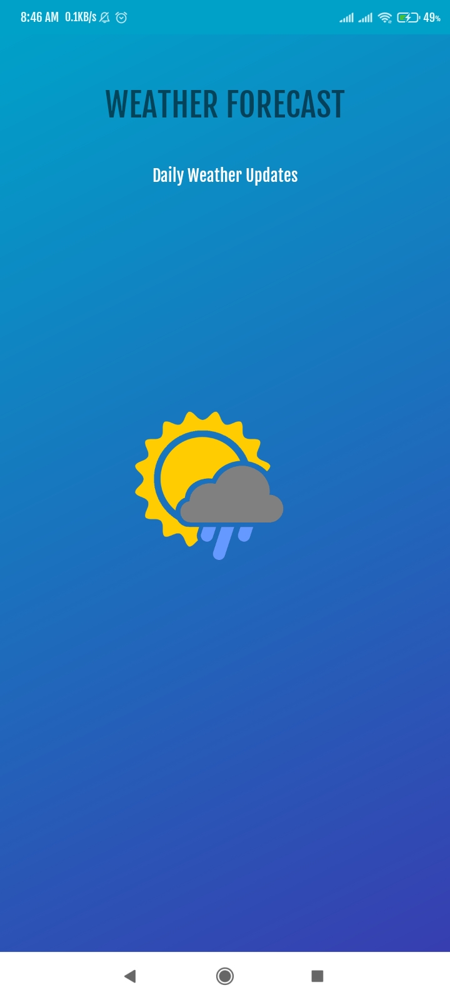
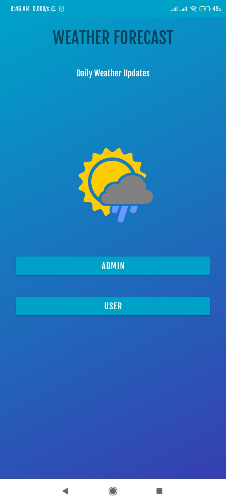
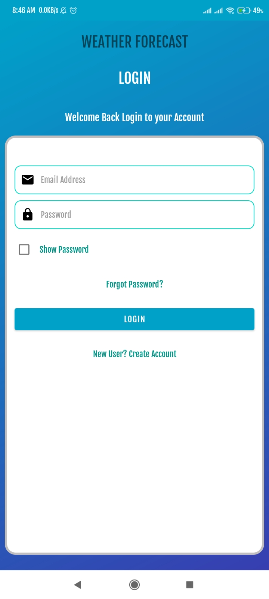
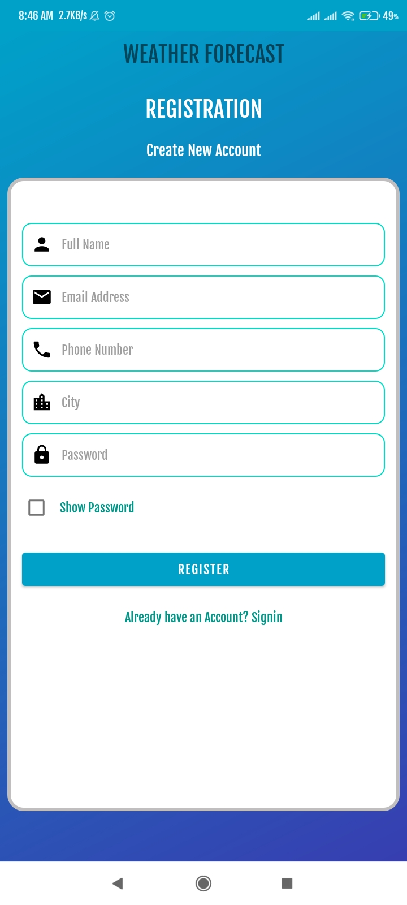
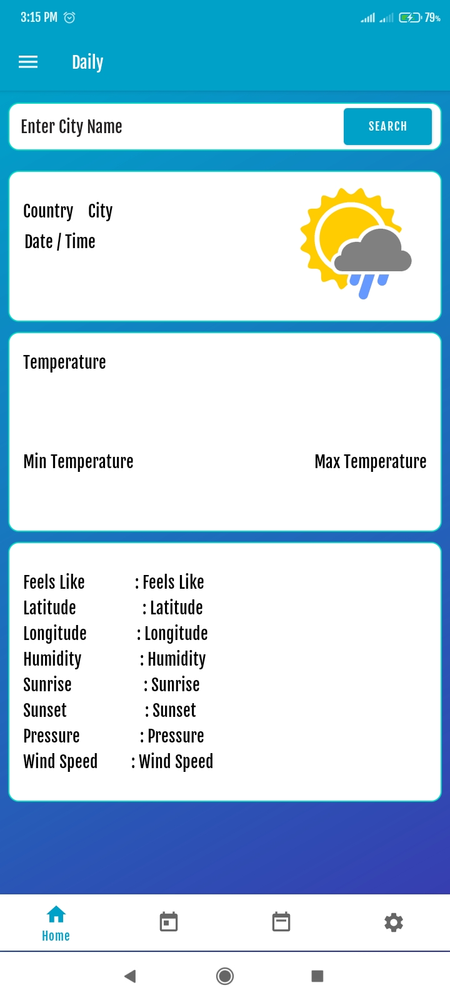
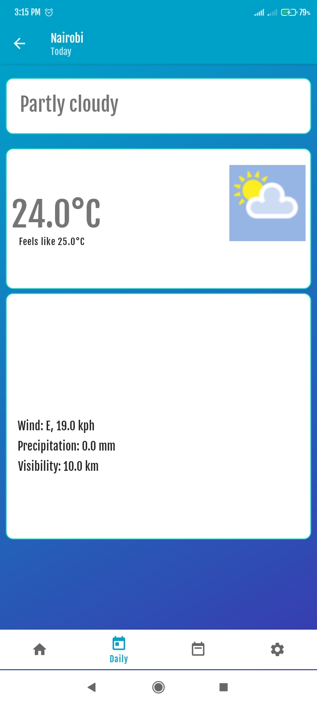
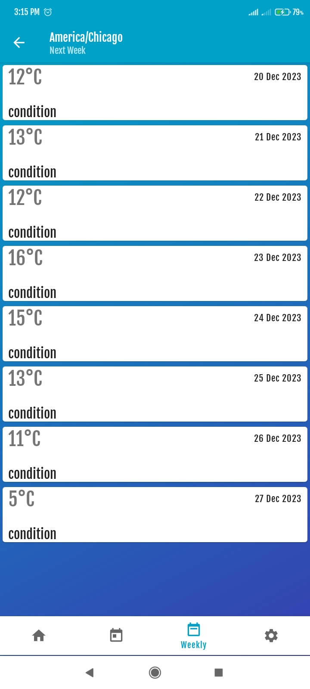
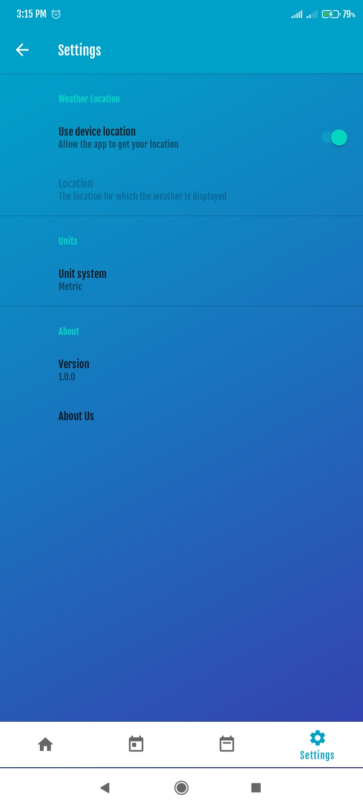

# WeatherRadarApp

A android app that predicts and notify on the updates of weather in a certain region it consumes the WeatherStack API
Database: Firebase
Weather API: WeatherStack API

## Demo
### Splash screen

### Home screen

### Login Screen

### Registration screen

### Daily weather

### Weather updates

### Weekly weather

### Settings screen

